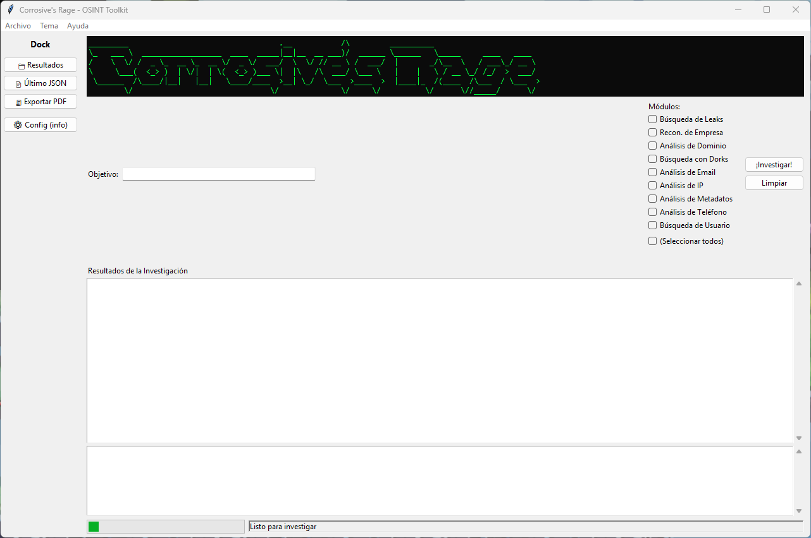

# 🕵️‍♂️ Corrosive's Rage
Framework modular y extensible de reconocimiento digital **OSINT** con soporte para **CLI** y **GUI**, diseñado para realizar análisis de dominios, correos electrónicos, direcciones IP, nombres de usuario, empresas, números de teléfono, leaks de datos y metadatos de documentos. Además, permite **generar informes en PDF** a partir de los resultados.


[](https://github.com/JoseGlezHerrera/corrosive_rage/releases)


> ⚡ Corrosive's Rage es un framework OSINT diseñado para el reconocimiento digital automatizado, con soporte modular tanto para CLI como para interfaz gráfica de escritorio.

### 🖼 Vista previa de la interfaz:



---

## ⚠️ Uso legal
Esta herramienta está pensada **únicamente para auditorías autorizadas**, prácticas de ciberseguridad y análisis sobre sistemas propios o con permiso explícito.  
**El uso contra sistemas ajenos sin autorización puede ser ilegal. Úsala bajo tu propia responsabilidad.**

---

## 📌 Características principales

- 🧩 **Arquitectura modular**: cada tipo de reconocimiento es un módulo independiente.
- 🔍 Recon de dominios, IPs, correos, usuarios, empresas, teléfonos, leaks de datos y metadatos.
- 💻 **CLI** para automatización y uso rápido desde terminal.
- 🖥️ **GUI** (interfaz gráfica) tipo programa de escritorio, con selector de módulos y visor de resultados.
- 🧾 **Exportación a PDF** de los resultados (informes listos para compartir).
- 📂 Resultados estructurados en ficheros JSON por ejecución.
- 🧪 Soporta ejecución sobre un único target o un archivo con múltiples targets.
- 🛠 Preparado para ampliarse con nuevos módulos sin tocar el núcleo.
- 📦 Proyecto paquetizado con `pyproject.toml` y comando `corrosive-rage` tras instalación.

---

## 🛠 Instalación

Clona el repositorio e instala las dependencias en un entorno virtual:

```bash
git clone https://github.com/JoseGlezHerrera/corrosive_rage
cd corrosive_rage

python -m venv .venv
# Linux / Mac
source .venv/bin/activate
# Windows

.venv\Scripts\activate

pip install -e .
```

---

## 🚀 Ejecución por CLI

La herramienta se ejecuta mediante un **único comando** y dos parámetros clave:

| Parámetro | Descripción                               |
|----------:|-------------------------------------------|
| `-m`      | Módulo OSINT a ejecutar                   |
| `-t`      | Target (objetivo) o fichero de objetivos  |

Tras la instalación editable (`pip install -e .`), puedes usar:

```bash
corrosive-rage -m <modulo> -t <objetivo>
```

Ejemplos:

```bash
# Recon de dominio
corrosive-rage -m domain_recon -t example.com

# Recon de IP
corrosive-rage -m ip_recon -t 8.8.8.8

# Recon de email
corrosive-rage -m email_recon -t persona@example.com

# Recon de username
corrosive-rage -m username_recon -t johndoe
```

---

## 🔄 Modo batch (targets.txt)

Puedes pasar un fichero de texto con múltiples objetivos (uno por línea), por ejemplo:

```text
example.com
otrodominio.net
johndoe
8.8.8.8
```

Ejecución:

```bash
corrosive-rage -m domain_recon -t targets.txt
```

El programa detectará automáticamente que `-t` es un archivo y procesará cada línea.

---

## 🖥 GUI (modo programa de escritorio)

La interfaz gráfica se encuentra en `corrosive_rage/gui/app.py` y permite trabajar sin tocar la terminal.

Desde el directorio del proyecto (con el entorno virtual activado):

```bash
python -m corrosive_rage.gui.app
```

o bien:

```bash
python corrosive_rage/gui/app.py
```

La GUI permite:

- Seleccionar uno o varios módulos OSINT.
- Introducir un objetivo (`target`).
- Lanzar la investigación con un botón (“¡Investigar!”).
- Ver los resultados formateados en un cuadro de texto.
- Abrir los últimos resultados guardados desde la propia interfaz.
- **Exportar los resultados a PDF** con un solo clic.

> La GUI utiliza `tkinter` (incluido en Python), y opcionalmente `ttkbootstrap` para un tema oscuro. La exportación a PDF requiere `reportlab`.

---

## 🧾 Exportación a PDF

Desde la GUI hay un botón **“🧾 Exportar PDF”** que genera un informe en PDF a partir de los últimos resultados:

- Busca los últimos ficheros JSON en la carpeta `results/`.
- Los agrupa en un informe legible.
- Genera un archivo con nombre similar a:
  ```text
  reports/corrosive_report_<target>_YYYYMMDD_HHMMSS.pdf
  ```
- Intenta abrir el PDF automáticamente al finalizar (en Windows, macOS o Linux).

---

## 📂 Estructura del proyecto

```text
corrosive_rage/
├── pyproject.toml
├── README.md
├── targets.txt
├── gui/
│   └── app.py                 # GUI (tkinter + ttkbootstrap opcional + exportación PDF)
└── src/
    ├── corrosive_rage/
    │   ├── __init__.py
    │   ├── __main__.py        # Permite: python -m corrosive_rage
    │   ├── cli.py             # Punto de entrada CLI (comando corrosive-rage)
    │   ├── core/              # Núcleo común (BaseModule, utilidades, etc.)
    │   ├── commands/          # Comandos de alto nivel (run, report, init, project...)
    │   └── modules/           # Módulos OSINT
    │       ├── breach_recon.py
    │       ├── company_recon.py
    │       ├── domain_recon.py
    │       ├── dork_recon.py
    │       ├── email_recon.py
    │       ├── ip_recon.py
    │       ├── metadata_recon.py
    │       ├── phone_recon.py
    │       ├── username_recon.py
    │       └── __init__.py
    └── results/               # Resultados JSON generados automáticamente
```

---

## 📊 Resultados

Cada ejecución genera un fichero JSON en la carpeta `results/`, con un nombre descriptivo:

```text
results/google.com_domain_recon_2025-11-17_125708.json
results/8.8.8.8_ip_recon_2025-11-17_130951.json
```

El contenido incluye la información más relevante recuperada por el módulo (WHOIS, DNS, GeoIP, APIs, etc.).

Estos JSON son los que la GUI utiliza para montar el informe PDF.

---

## 🔌 Módulos soportados

Actualmente, el proyecto incluye los siguientes módulos OSINT:

| Módulo             | Descripción rápida                                                                 |
|--------------------|-------------------------------------------------------------------------------------|
| `domain_recon`     | WHOIS, DNS, registros, resolución, posibles subdominios y metadata de dominio.    |
| `email_recon`      | Validación de email, dominios asociados, MX, posibles leaks vía APIs externas.    |
| `ip_recon`         | GeoIP, ASN, ISP, rangos de red, información de infraestructura.                   |
| `username_recon`   | Búsqueda de usuario en distintas plataformas, presencia en redes, perfiles, etc.  |
| `breach_recon`     | Comprobación de posibles leaks de datos asociadas al target (según APIs config.). |
| `company_recon`    | Recopilación de información básica de empresas, presencia online y metadatos.     |
| `dork_recon`       | Dorks automatizados en buscadores para localizar info expuesta relacionada.       |
| `metadata_recon`   | Análisis de metadatos en PDFs, DOCX y otros documentos soportados.                |
| `phone_recon`      | Búsqueda y validación básica de números de teléfono (información pública).        |

> Todos los módulos heredan de una clase base común, lo que facilita añadir nuevos módulos reutilizando lógica de logging, manejo de errores y escritura de resultados.

---

## 🧰 Extender con nuevos módulos

Para añadir un nuevo módulo:

1. Crear un nuevo archivo en `src/corrosive_rage/modules/` (por ejemplo, `social_recon.py`).
2. Heredar de la clase base de módulos (`BaseModule`) definida en `core.base`.
3. Implementar el método `run()` devolviendo un diccionario con los resultados.
4. Registrar el módulo en el sistema de carga de módulos (si aplica).

De esta forma, el CLI podrá llamarse con:

```bash
corrosive-rage -m social_recon -t objetivo
```

---

## 🧪 Estado del proyecto / Roadmap

- ✅ Refactor a paquete Python con `pyproject.toml`
- ✅ CLI unificado mediante el comando `corrosive-rage`
- ✅ Módulos principales de recon implementados
- ✅ GUI básica con selector de módulos y visor de resultados
- ✅ Exportación de resultados a PDF desde la GUI
- 🔄 Mejora continua del manejo de errores y logs
- 🔜 Integración más profunda con APIs como Shodan, HIBP y similares
- 🔜 Tests automáticos para cada módulo

---

## 🧩 Última versión estable

👉 https://github.com/JoseGlezHerrera/corrosive_rage/releases/latest

---

## 📝 Licencia

Este proyecto está licenciado bajo **MIT**.  
Eres libre de usar, modificar y distribuir el código respetando los términos de la licencia.

---

## 👤 Autor

**José González aka Corrosive**  
GitHub: https://github.com/JoseGlezHerrera  
Contacto: jose.gonzalezh@protonmail.com

> “El conocimiento sin ética es puro veneno”.